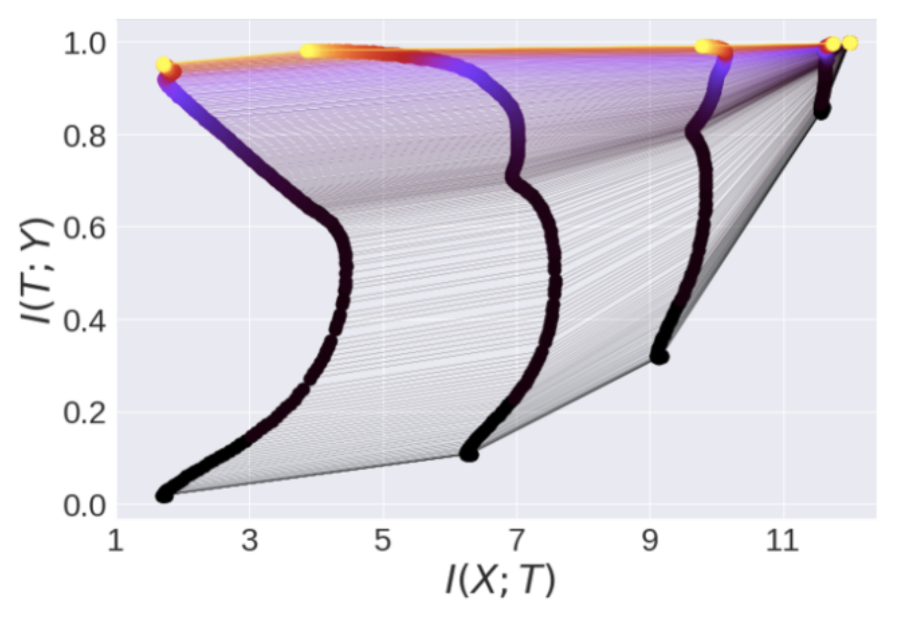
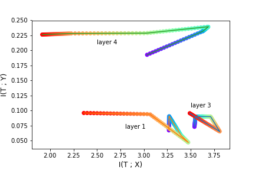

# Tractability of the Information Bottleneck for Deep Networks

Tishby and Zaslavky [2015] proposed a framework to explain the learning process of neural networks. 

They consider supervised learning, where the network has inputs $X$ and produces activations $T$ as it predicts labels $Y$.
Examining the mutual informations $I(T;X)$ and $I(T;Y)$, they observed two phases during the training process. 
The first is a "fitting" phase, in which $I(T;X)$ and $I(T;Y)$ jointly increase, as the learned features $T$ go from randomly initialized to capturing information about both $X$ that helps predict $Y$.
The second is a "compression" phase, in which $I(T;Y)$ continues to increase while $I(T;X)$ decreases.
The interpretation of this is that the network tunes its representation of $X$ so that it discards irrelevant information. Ideally, $T$ should extract the pertinent information to predict $Y$, but filter out extraneous details, which helps with generalization.

$I(T;Y) = H(T) - H(T|Y)$ and $I(T;X) = H(T) - H(T|X) = H(T)$ (the network is deterministic, so $H(T|X) = 0$).
They then discretize the input and activation spaces, and estimate the entropy using the empirical bin counts.
Using this procedure, their analysis is limited to toy networks and datasets (on order of 10s of inputs and features) so that the different possible values of $T, X, Y$ can be enumerated during the entropy computation.

To investigate whether the phenomenon of the information bottleneck still appears for larger networks and real datasets, we employed *_deep generative models_* to estimate the density functions $p(T)$ and $p(T|Y)$.
In particular, we used an autoregressive model styled after PixelCNN. Such methods factor the joint distribution $p(\mathbf{x})$ over $\mathbf{x} \in \mathbf{R}^n$ into a product of conditional distributions over its elements:
$ p(\mathbf{x}) = p(x_1, \dots, x_n) = \prod_{i=1}^{n} p(x_i|x_1, \dots, x_{i-1}) $.
and then use a neural network to parametrize $p(x_i|x_{1:i-1})$. Given $x_1, \dots, x_{i-1}$, the network outputs a distribution over $x_i$ and is trained to maximize $\log p(\mathbf{x})$.

We trained a fully-connected network on the MNIST dataset, saved its activations at different points in the training process.
For each layer and iteration, we discretized each element of the activations into 32 bins, and trained two generative models. These modeled $p(T)$ and $p(T|Y)$; the only difference being that the latter received the label $Y$ as an additional input.
We then estimated $H(T) = -\mathbf{E}[\log p(T)]$ and $H(T|Y) = - \mathbf{E}[\log p(T|Y)]$, using the probabilities produced by our models and taking the expectation over the MNIST test set.

## Running the code
First you need to train an MNIST model and save the activations at different layers. Our Mnist model has 2 hidden layers, each with 256 hidden units and tanh nonlinearities. We consider the output layer, and after each activation function. We look at the values for iterations 0, 5, 10, 20, 1000, 9000. The code defaults to running on the 0th GPU. Run ```nvidia-smi``` to check which GPUs are avaliable on your machine.
```
python train_model.py --devices <GPU_NUM>
```
Now that you have the data, you can train the generator models. To speed up this process, we use MPI for parallelizing the workload. As an example, if GPUs 0,1,2,3 are avaliable, you would run
```
mpirun -np 4 python generator.py --devices 0,1,2,3
```

You can look at ```plots.ipynb``` for generating plots visualizing the results.

## Results

As a reference, this is the figure from Tishby and Zaslavky on their toy network.
<p align="center">
    
</p>
And here is ours
<p align="center">
    
</p>

The two phases are apparent for $I(T;X)$, which increases and then decreases significantly for all layers. $I(T;Y)$ generally increases, but there are a few outlying points from the overall trend. These could be attributed to inaccuracies in the fitted generative model, or could indicate that the information bottleneck phenomenon does not occur as prominently in deeper networks.
Although the results did not perfectly match the expected behavior, this the first (to our knowledge) analysis of the information bottleneck on nontrivial networks with nontrivial data.


